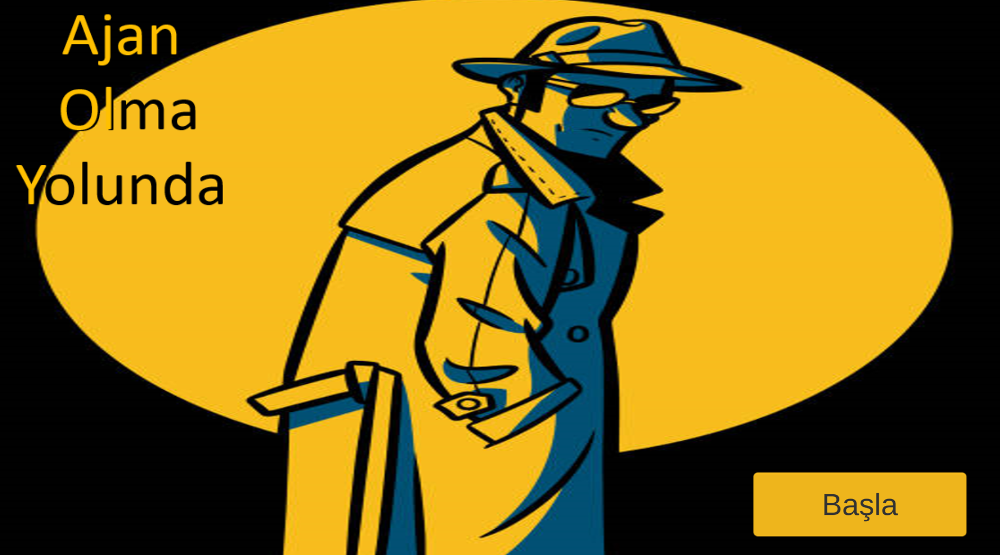
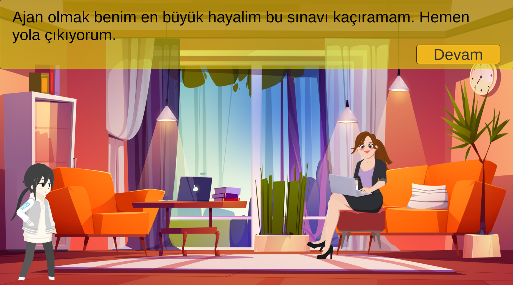
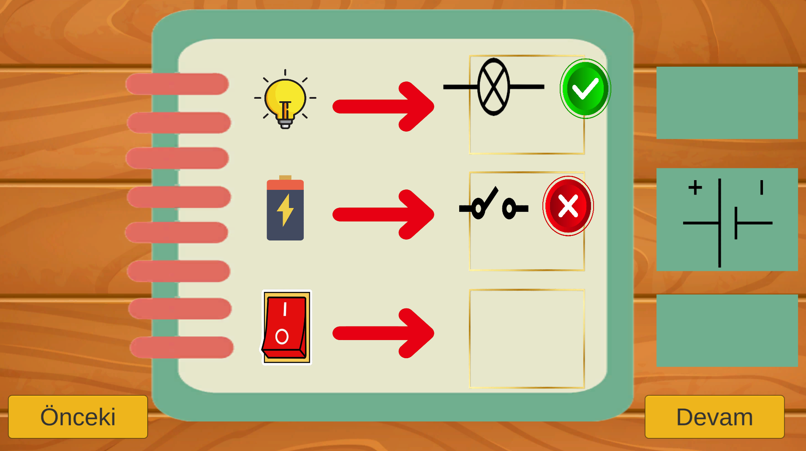
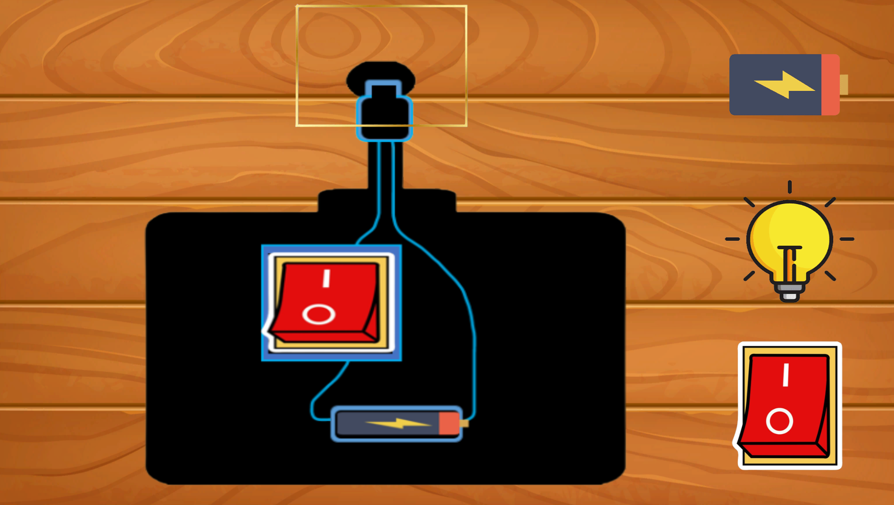

# 🕵️‍♂️ Path to Becoming an Agent

**"Ajan Olma Yolunda"** is a 2D educational adventure game designed specifically for **4th grade primary school students**. The game aims to teach the basic concepts of **simple electric circuits** through interactive and engaging gameplay.

---

## 🎯 Game Concept

The story begins with a child who dreams of becoming a secret agent and successfully passes the agent exam. As a **trainee agent**, the main character is introduced to agent tools by a mentor. The mentor explains that all these tools function with **electric circuits**.

Players are then expected to:
- Observe the circuits  
- Assemble them  
- Apply what they learn

This process unfolds across multiple levels, each building on previous knowledge.

---

## 🕹️ How to Play

- The game consists mostly of **drag-and-drop** activities tailored to the cognitive level of 4th grade students.
- Players interact with objects to complete circuit-based puzzles and challenges.
- Each level is designed to promote learning while having fun.

---

## ⚙️ Technologies Used

- Game Engine: **Unity 2D**
- Programming Language: **C#**
- Design Tools: **Adobe Photoshop**, **pre-made visual assets**

---

## 📸 Screenshots

Below are some in-game screenshots:

  
  
  
  

---

## 👨‍💻 Developer

**Mustafa Tunç**  
Department of Computer Education and Educational Technologies  
Boğaziçi University  
GitHub: [@tuncmstf](https://github.com/tuncmstf)

---

## 📄 License

This project was developed for educational purposes and is not licensed for commercial use.
